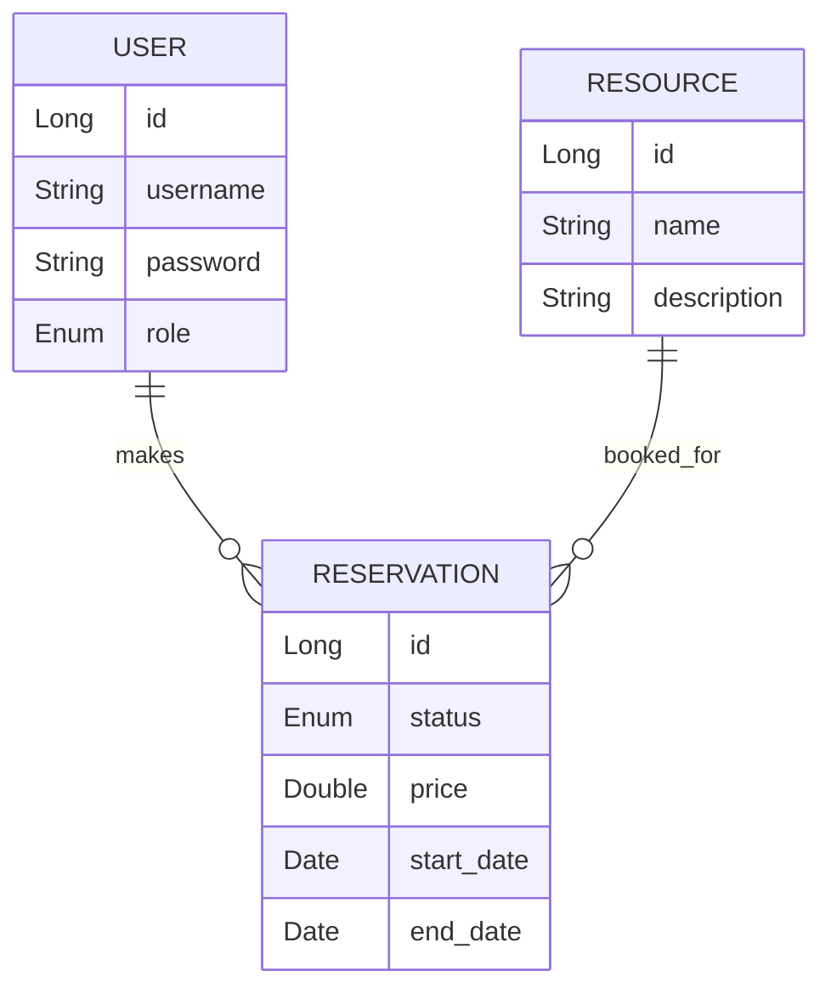

# 🚀 Booking System (Spring Boot + JWT + RBAC)

A RESTful booking system built with **Spring Boot 3, Java 17, and MySQL/PostgreSQL**.
It supports **JWT authentication, role-based access (ADMIN/USER)**, and **resource & reservation management** with filtering, pagination, and sorting.

---

## 📌 Features

* 🔐 **JWT Authentication** with Role-Based Access Control (RBAC)

  * **ADMIN** → Full CRUD on resources & reservations
  * **USER** → View resources, create reservations, view own reservations
* 📦 **Resources Management** (rooms, vehicles, equipment, etc.)
* 📝 **Reservations** with status (`PENDING`, `CONFIRMED`, `CANCELLED`) and price
* 🔍 **Filtering, Pagination & Sorting** support
* ⚡ **Secure password storage** using BCrypt
* 📖 **Swagger/OpenAPI documentation**
* 📂 **Postman collection included**

---

## 🏗️ Tech Stack

* **Backend**: Spring Boot 3, Java 17
* **Database**: MySQL / PostgreSQL
* **Security**: Spring Security, JWT
* **Build Tool**: Maven
* **Documentation**: Swagger

---

## ⚙️ Installation & Setup

### 1. Clone the repository

```bash
git clone https://github.com/your-username/booking-system.git
cd booking-system
```

### 2. Configure Database

Update `application.properties` with your database credentials:

```properties
spring.datasource.url=jdbc:mysql://localhost:3306/bookingdb
spring.datasource.username=root
spring.datasource.password=yourpassword
spring.jpa.hibernate.ddl-auto=update
spring.jpa.show-sql=true
```

### 3. Run the application

```bash
mvn spring-boot:run
```

Application will start on: `http://localhost:8080`

---

## 👥 Default Test Users

* **Admin** → `admin / admin123` (ROLE\_ADMIN)
* **User** → `user / user123` (ROLE\_USER)

---

## 📌 API Endpoints

### 🔑 Authentication

* `POST /api/auth/register` → Register new user
* `POST /api/auth/login` → Login & get JWT token

### 📦 Resources

* `GET /api/resources` → Get all resources
* `POST /api/resources` → Create resource (ADMIN only)
* `PUT /api/resources/{id}` → Update resource (ADMIN only)
* `DELETE /api/resources/{id}` → Delete resource (ADMIN only)

### 📝 Reservations

* `GET /api/reservations` → Get all reservations (ADMIN only)
* `GET /api/reservations/my` → Get logged-in user’s reservations
* `POST /api/reservations` → Create reservation (USER only)
* `PUT /api/reservations/{id}` → Update reservation status (ADMIN only)
* `DELETE /api/reservations/{id}` → Cancel reservation

---

## 📖 Swagger Documentation

After running the app, visit:
👉 `http://localhost:8080/swagger-ui.html`

---

## 🛠️ Postman Collection

A ready Postman collection is available in the repository for quick testing.

---

## 🗄️ ER Diagram



---

## 🏛️ Architecture Diagram

```mermaid
flowchart TD
    A[Client (Postman / Angular / React)] -->|HTTP/JSON| B[Spring Boot REST API]
    B --> C[Controller Layer]
    C --> D[Service Layer]
    D --> E[Repository Layer (JPA/Hibernate)]
    E --> F[(Database: MySQL/PostgreSQL)]
    B --> G[Spring Security + JWT]
